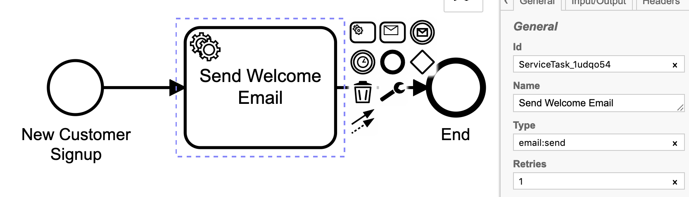

# Transactional Email Microservice for Zeebe

Send templated transactional emails using Amazon SES from BPMN processes in [Zeebe.io](https://zeebe.io). 



Watch me code this project from scratch live on YouTube:

* [Part 1](https://www.youtube.com/watch?v=19LXTZc9KZM)
* [Part 2](https://www.youtube.com/watch?v=SY9TWHnCFJw)

A common task in any modern business is to send a transactional email: a welcome email, a password reset email, a receipt.

This task worker services tasks of type `email:send`. The task should have a custom header with a key `email:template` with the name of the template to use. The template is used to generate plain-text and HTML email bodies with the variables from the job bound. The compiled email is then sent to the recipient using AWS SES.

The worker fetches `email`, `firstName`, and `lastName` variables from the broker. 

This worker is not intended to be used as-is, as a drop-in task worker, but rather as a POC to give you an idea on how to code something like this up for your system. Making a general-purpose, reusable service takes a lot of work, and requires a lot of abstract configuration. For example: should it support Mailgun? Sendgrid? What templating variables should it support and how should it support them?

You can use this as a starter for your own transactional mail microservice, and structure it to fit your use-case.

## To Run

1. Start a local Zeebe broker using the [zeebe-docker-compose]() docker images (or set the environment variable ZEEBE_ADDRESS to point to your existing broker, or set the variables to [connect to Camunda Cloud](https://zeebe.io/blog/2019/09/getting-started-camunda-cloud/)).
2. Clone this repo.
3. Run `npm i && npm i -g pino-pretty` to install deps.
4. Get your AWS SES credentials (Google it).
5. Put them in the environment:

```
export ZEEBE_TXES_FROM_EMAIL=<your authorised sending address>
export ZEEBE_TXES_AWS_SES_KEY=<AWS SES credential key>
export ZEEBE_TXES_AWS_SES_SECRET=<AWS SES credential secret>
```

6. Start the microservice: `npm run start:dev | pino-pretty`
7. Open the url http://localhost:3000/your@email.address/yourFirstName/yourLastName

(Obviously substituting the values in the URL).

You should receive a welcome email in your inbox from the microservice.

Watch the videos for more insight, or just read the code. Or why not both?

Packages used in this POC:

* [@payk/nestjs-zeebe](https://www.npmjs.com/package/@payk/nestjs-zeebe) - A zeebe transport and client for NestJS.
* [@payk/nestjs-winston](https://www.npmjs.com/package/@payk/nestjs-winston) - Winston for NestJS has never been this easy!
* [micromustache](https://www.npmjs.com/package/micromustache) - A secure, fast and lightweight template engine with some handy additions.
* [mailgen](https://www.npmjs.com/package/mailgen) - A Node.js package that generates clean, responsive HTML e-mails for sending transactional mail.
* [node-ses](https://www.npmjs.com/package/node-ses) - A simple and reliable Node.js mail for sending mail through Amazon SES.

---
<p align="center">
  <a href="http://nestjs.com/" target="blank"></a>
</p>

[travis-image]: https://api.travis-ci.org/nestjs/nest.svg?branch=master
[travis-url]: https://travis-ci.org/nestjs/nest
[linux-image]: https://img.shields.io/travis/nestjs/nest/master.svg?label=linux
[linux-url]: https://travis-ci.org/nestjs/nest
  
  <p align="center">A progressive <a href="http://nodejs.org" target="blank">Node.js</a> framework for building efficient and scalable server-side applications, heavily inspired by <a href="https://angular.io" target="blank">Angular</a>.</p>
    <p align="center">
<a href="https://www.npmjs.com/~nestjscore"></a>
<a href="https://www.npmjs.com/~nestjscore"></a>
<a href="https://www.npmjs.com/~nestjscore"></a>
<a href="https://travis-ci.org/nestjs/nest"></a>
<a href="https://travis-ci.org/nestjs/nest"></a>
<a href="https://coveralls.io/github/nestjs/nest?branch=master"></a>
<a href="https://gitter.im/nestjs/nestjs?utm_source=badge&utm_medium=badge&utm_campaign=pr-badge&utm_content=body_badge"></a>
<a href="https://opencollective.com/nest#backer"></a>
<a href="https://opencollective.com/nest#sponsor"></a>
  <a href="https://paypal.me/kamilmysliwiec"></a>
  <a href="https://twitter.com/nestframework"></a>
</p>
  <!--[](https://opencollective.com/nest#backer)
  [](https://opencollective.com/nest#sponsor)-->

## Description

[Nest](https://github.com/nestjs/nest) framework TypeScript starter repository.

## Installation

```bash
$ npm install
```

## Running the app

```bash
# development
$ npm run start

# watch mode
$ npm run start:dev

# production mode
$ npm run start:prod
```

## Test

```bash
# unit tests
$ npm run test

# e2e tests
$ npm run test:e2e

# test coverage
$ npm run test:cov
```

## Support

Nest is an MIT-licensed open source project. It can grow thanks to the sponsors and support by the amazing backers. If you'd like to join them, please [read more here](https://docs.nestjs.com/support).

## Stay in touch

- Author - [Kamil Myśliwiec](https://kamilmysliwiec.com)
- Website - [https://nestjs.com](https://nestjs.com/)
- Twitter - [@nestframework](https://twitter.com/nestframework)

## License

  Nest is [MIT licensed](LICENSE).
